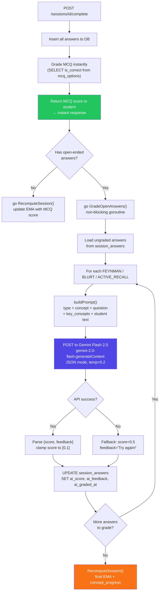
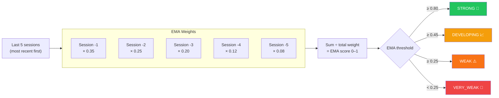

# AI Grading Pipeline

Only three question types need AI: **FEYNMAN**, **BLURT**, and **ACTIVE_RECALL**.
MCQ and DESCRIPTIVE are either auto-graded or self-assessed.

## Why each type needs AI

| Type | What the student does | Why AI? |
|---|---|---|
| `FEYNMAN` | Explain concept to an imaginary friend | Open-ended — no single right answer; AI checks if key concepts are covered clearly |
| `BLURT` | Brain-dump everything they remember in 3 mins | Completeness check against the concept's topic |
| `ACTIVE_RECALL` | Apply concept to a new real-world scenario | Reasoning quality — did they use the concept correctly? |
| `MCQ` | Pick A/B/C/D | Instant DB lookup — no AI needed |
| `DESCRIPTIVE` | Short written answer | Rubric hint shown to student; self-assessed |

## Grading Pipeline



## Prompt Design

The prompt is built by `buildPrompt()` in `internal/grade/grader.go`. Key decisions:

### FEYNMAN prompt

```
You are grading a Class 6 Indian student's answer for the BrainMaps learning app.

Concept: Ancient Texts of India
Question type: FEYNMAN
Question: Your friend asks "Why did ancient Indians memorise the Vedas instead
          of writing them down right away?" Explain two possible reasons.
Key concepts that should be covered:
  writing was rare and expensive — palm leaves hard to prepare in large numbers;
  oral tradition was trusted — trained reciters memorised word for word;
  sacred sound considered essential — reading seen as less reliable;
  this was the culture before printing existed

Student's answer: [student text]

Score criteria (0.0–1.0):
- 0.8–1.0: covers all key concepts clearly and simply, like explaining to a friend
- 0.5–0.8: covers most key concepts but unclear or incomplete
- 0.2–0.5: partially correct but missing major ideas
- 0.0–0.2: off-topic or fundamentally wrong

Be encouraging. The feedback must be one short sentence (max 15 words) for a 12-year-old.
Return ONLY valid JSON: {"score": 0.XX, "feedback": "..."}
```

### BLURT prompt

```
...
Question type: BLURT
Question: Write everything you remember about [blurt topic]

Score criteria (0.0–1.0):
- 0.8–1.0: comprehensive brain-dump covering most key facts
- 0.5–0.8: good recall but missing some important points
- 0.2–0.5: partial recall — only a few facts mentioned
- 0.0–0.2: almost nothing relevant recalled
...
```

### Gemini API settings

| Setting | Value | Reason |
|---|---|---|
| Model | `gemini-2.0-flash` | Fastest + cheapest; 1500 req/day free |
| `responseMimeType` | `application/json` | Forces structured output, no parsing ambiguity |
| `temperature` | `0.2` | Low randomness → consistent scores |
| `maxOutputTokens` | `256` | Score + one sentence only |

## EMA Recomputation After Grading



## Failure Handling

| Failure | Behaviour |
|---|---|
| Gemini API timeout (>10s) | Goroutine context cancelled; fallback score 0.5 used |
| HTTP 429 rate limit | Fallback score 0.5 + "We'll grade this later" feedback |
| Malformed JSON from Gemini | `json.Unmarshal` error → fallback 0.5 |
| DB write failure | Log error; session still marked complete with MCQ score |

The student always gets their MCQ result immediately. AI grading failure only means the open-ended component defaults to 0.5 (neutral) — the session is never stuck.
