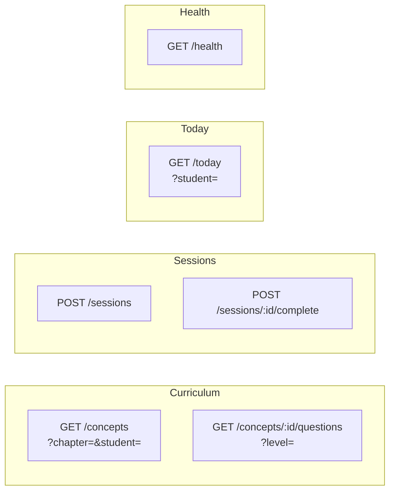

# API Reference

Base URL: `http://localhost:8080/api/v1` (dev) · `https://api.brainmaps.in/api/v1` (prod)

All responses are JSON. All timestamps are RFC 3339 / UTC.

## Endpoint Map



---

## GET `/concepts`

Returns all concepts in a chapter with the student's progress overlay.

**Query params**

| Param | Required | Example |
|---|---|---|
| `chapter` | ✓ | `soc_chB` |
| `student` | ✓ | `uuid` |

**Response** `200 OK`

```json
[
  {
    "id": "s203",
    "subjectKey": "soc",
    "chapterId": "soc_chB",
    "name": "What is Bharat?",
    "orderIdx": 3,
    "progress": {
      "studentId": "...",
      "conceptId": "s203",
      "emaScore": 0.39,
      "state": "WEAK",
      "l1Done": true,
      "l2Done": false,
      "l3Done": false,
      "strengthenDone": false,
      "totalAttempts": 5,
      "lastSessionAt": "2026-06-06T10:30:00Z"
    },
    "reviseSchedule": null
  }
]
```

`progress` is `null` if the student has never attempted the concept.

---

## GET `/concepts/:id/questions`

Returns questions for one station of a concept. Used by the Sharpen page.

**Query params**

| Param | Required | Values |
|---|---|---|
| `level` | ✓ | `level1` \| `level2` \| `level3` \| `strengthen` \| `revise` |

**Response** `200 OK`

```json
[
  {
    "id": "s203_l1_mcq",
    "conceptId": "s203",
    "type": "MCQ",
    "level": "level1",
    "text": "In the Ṛig Veda...",
    "explanation": "Sapta Sindhava means...",
    "options": [
      { "key": "a", "text": "The land of the seven rivers", "isCorrect": true },
      { "key": "b", "text": "The land of the seven mountains", "isCorrect": false }
    ]
  },
  {
    "id": "s203_l1_desc",
    "type": "DESCRIPTIVE",
    "level": "level1",
    "text": "Name any two ancient names...",
    "rubricHint": "Any two of: Sapta Sindhava — Ṛig Veda...",
    "options": []
  }
]
```

> **Note on Strengthen:** The frontend builds the interleaved Strengthen question list client-side using `splitStations()`. The API only needs to return `level=strengthen` questions (the BLURT). Level 1–3 questions for Strengthen interleaving are already loaded from the prior station calls.

---

## POST `/sessions`

Creates a new session for a student.

**Request body**

```json
{
  "studentId": "uuid",
  "conceptId": "s203",
  "station": "level1"
}
```

**Response** `201 Created`

```json
{ "sessionId": "abc-123-uuid" }
```

---

## POST `/sessions/:id/complete`

Submits all answers for a session. Returns immediately with the MCQ score; AI grading happens in the background.

**Request body**

```json
{
  "answers": [
    {
      "questionId": "s203_l1_mcq",
      "questionType": "MCQ",
      "chosenOption": "a"
    },
    {
      "questionId": "s203_l1_feyn",
      "questionType": "FEYNMAN",
      "studentText": "Bharat is the ancient name that comes from the Rig Veda..."
    }
  ]
}
```

**Response** `200 OK`

```json
{
  "sessionId": "abc-123-uuid",
  "score": 1.0,
  "passed": true,
  "newState": "DEVELOPING",
  "aiGrading": true
}
```

| Field | Notes |
|---|---|
| `score` | MCQ-only score (0–1). Updated to include AI scores asynchronously. |
| `passed` | `true` if score ≥ 0.80 |
| `newState` | Student's mastery state after this session |
| `aiGrading` | `true` = FEYNMAN/BLURT/ACTIVE_RECALL answers are being graded async |

---

## GET `/today`

Returns the student's Fix queue and Revise queue for today.

**Query params**

| Param | Required |
|---|---|
| `student` | ✓ |

**Response** `200 OK`

```json
{
  "fixQueue": [
    {
      "id": "s203",
      "name": "What is Bharat?",
      "progress": { "emaScore": 0.39, "state": "WEAK", ... }
    }
  ],
  "reviseQueue": [
    {
      "id": "s201",
      "name": "Reading Time: BCE & CE",
      "progress": { "emaScore": 0.81, "state": "STRONG", ... },
      "reviseSchedule": { "intervalDays": 7, "nextDueAt": "2026-06-06T00:00:00Z" }
    }
  ]
}
```

---

## GET `/health`

```
200 OK
ok
```

Used by Fly.io health checks to decide if the instance is ready.

---

## Error format

```json
{ "error": "session not found or already completed" }
```

| HTTP Status | When |
|---|---|
| `400` | Missing required param or malformed body |
| `404` | Session / concept not found |
| `500` | DB error (logged server-side) |
