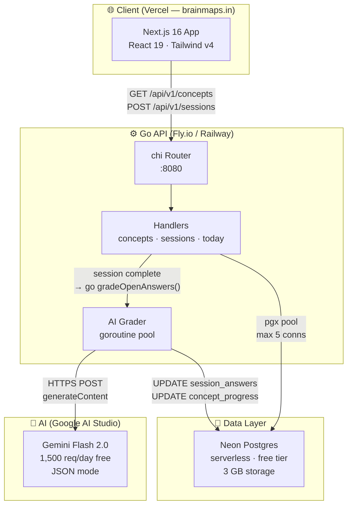
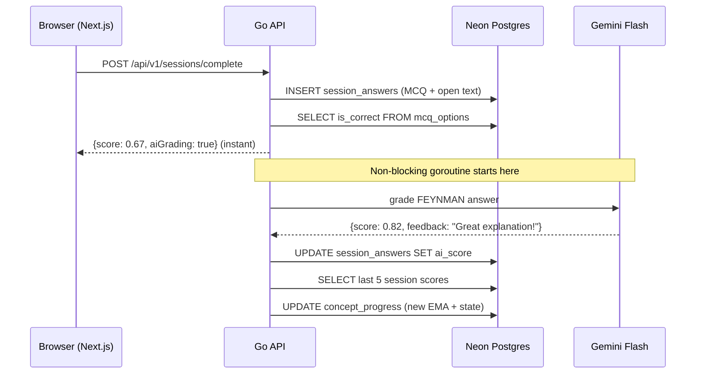

# System Architecture

## Component Overview



## Request Lifecycle



## Directory Structure

```
backend/
├── cmd/
│   └── server/
│       └── main.go            ← entry point, graceful shutdown
├── internal/
│   ├── api/
│   │   ├── router.go          ← chi routes + CORS middleware
│   │   └── handlers/
│   │       ├── concepts.go    ← GET /concepts, GET /concepts/{id}/questions
│   │       ├── sessions.go    ← POST /sessions, POST /sessions/{id}/complete
│   │       └── today.go       ← GET /today (fix queue + revise queue)
│   ├── db/
│   │   └── db.go              ← pgxpool initialisation
│   ├── grade/
│   │   └── grader.go          ← Gemini API call + EMA recomputation
│   └── models/
│       └── models.go          ← all shared types
├── migrations/
│   ├── 001_schema.sql         ← tables + indexes
│   └── 002_seed_tapestry.sql  ← Tapestry of the Past question data
├── docs/                      ← you are here
├── go.mod
├── go.sum
└── .env.example
```

## Hosting Plan (zero cost to start)

| Service | What runs there | Free limit |
|---|---|---|
| **Vercel** | Next.js frontend | 100 GB bandwidth/month |
| **Fly.io** | Go API (256 MB RAM, shared CPU) | 3 shared VMs free |
| **Neon** | Postgres database | 3 GB storage, scales to zero |
| **Google AI Studio** | Gemini Flash grading | 1,500 requests/day |

Scale path: Neon → paid plan at >3 GB. Gemini → paid at >1,500 req/day (~150 active students doing 10 open questions each).
