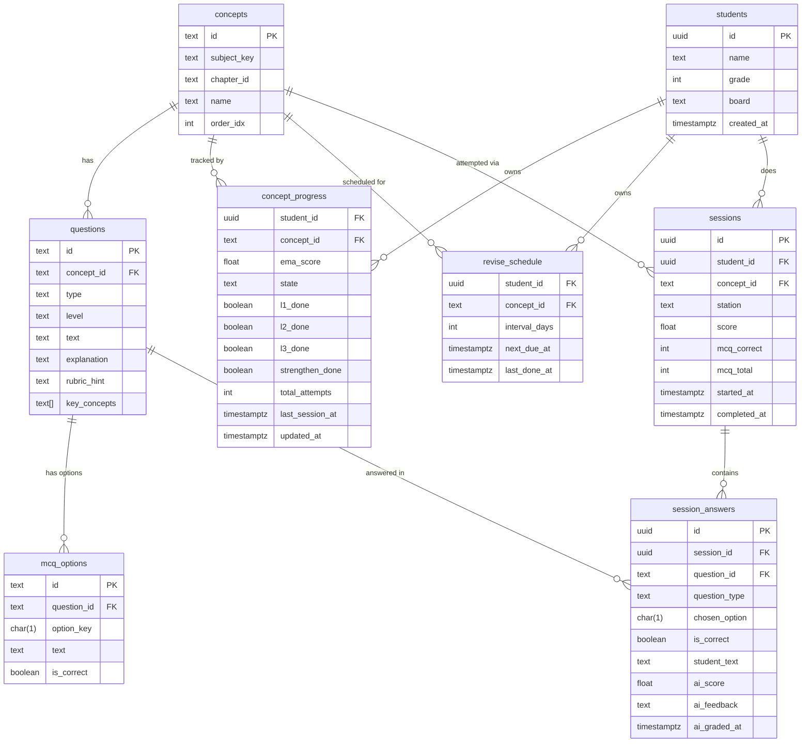

# Database Schema

Serverless Postgres on **Neon**. All tables created by `migrations/001_schema.sql`.

## Entity Relationship Diagram



## Table Reference

### `concepts`
Mirrors the curriculum manifest in the frontend (`society.ts`). One row per concept.

| Column | Type | Notes |
|---|---|---|
| `id` | `text` | e.g. `s203`, `s204` |
| `subject_key` | `text` | `soc`, `sci`, etc. |
| `chapter_id` | `text` | `soc_chB` |
| `name` | `text` | Display name |
| `order_idx` | `int` | Position within chapter |

### `questions`
All question types in one table. `key_concepts` is used by the AI grader for FEYNMAN answers.

| Column | Type | Notes |
|---|---|---|
| `type` | `text` | `MCQ` \| `DESCRIPTIVE` \| `FEYNMAN` \| `BLURT` \| `ACTIVE_RECALL` |
| `level` | `text` | `level1` \| `level2` \| `level3` \| `strengthen` \| `revise` |
| `key_concepts` | `text[]` | Checked by AI grader for FEYNMAN coverage |
| `rubric_hint` | `text` | Shown to student after DESCRIPTIVE |

### `concept_progress`
Composite PK `(student_id, concept_id)`. One row per student×concept pair.

| Column | Notes |
|---|---|
| `ema_score` | 0–1, weighted average of last 5 sessions. See [scoring.md](./scoring.md) |
| `state` | Derived from `ema_score`: VERY_WEAK / WEAK / DEVELOPING / STRONG |
| `l1_done … strengthen_done` | Set to `true` when that station's session scores ≥ 0.60 |

### `student_weak_concepts`
Composite PK `(student_id, concept_id, tag)`. One row per weakness the student has shown, keyed by a normalized (`lower(trim())`) tag drawn from `questions.key_concepts`. Written by the grading lifecycle, read by adaptive retry selection. Added in migration 006.

| Column | Notes |
|---|---|
| `status` | `active` (drives retry targeting) or `cleared` (eligible for spaced recheck) |
| `wrong_count` | Times the tag appeared in a session's weakness output — ranks retry focus |
| `correct_streak` | Consecutive sessions where the tag was tested clean; clears at 2 |
| `cleared_at` | Set on clear; revise sessions re-test tags cleared in the last 30 days |

Lifecycle rules (see `grade.updateWeakConceptLifecycle`):
- Tag in a session's weakness output → `wrong_count + 1`, `status = 'active'`, streak reset (this also reactivates a `cleared` tag whose recheck was missed)
- Tag tested clean (≥ 50% of its questions correct, not flagged weak) → `correct_streak + 1`; cleared at streak 2
- Tag not tested in a session → untouched

### `session_answers`
One row per question per session. MCQ answers are graded instantly; open-ended answers get `ai_score` set async.

| Column | When populated |
|---|---|
| `chosen_option`, `is_correct` | MCQ only — set on `POST /sessions/{id}/complete` |
| `student_text` | FEYNMAN / BLURT / ACTIVE_RECALL — stored immediately |
| `ai_score`, `ai_feedback`, `ai_graded_at` | Set async by the Gemini grading goroutine |

### `revise_schedule`
SRS intervals: **1 → 3 → 7 → 21 → 60** days.

`next_due_at` = `last_done_at + interval_days`. When the student passes the Revise station, `interval_days` advances to the next value and `next_due_at` is updated.

## Index Strategy

```sql
-- Brain Map page: fetch all concepts for a chapter fast
idx_concepts_chapter        ON concepts(chapter_id)

-- Sharpen page: load questions by concept + level
idx_questions_concept_level ON questions(concept_id, level)

-- Today's page: find sessions for EMA recomputation
idx_sessions_student_concept ON sessions(student_id, concept_id, completed_at DESC)

-- Revise queue: find concepts due today
idx_revise_due              ON revise_schedule(student_id, next_due_at)

-- Background grader: find ungraded open answers
idx_answers_ungraded        ON session_answers(session_id)
                            WHERE ai_graded_at IS NULL
```
