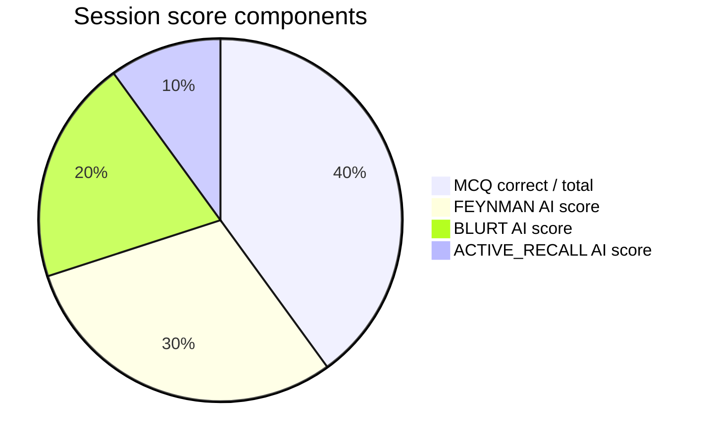
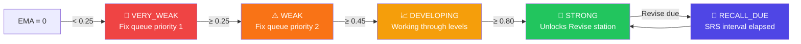
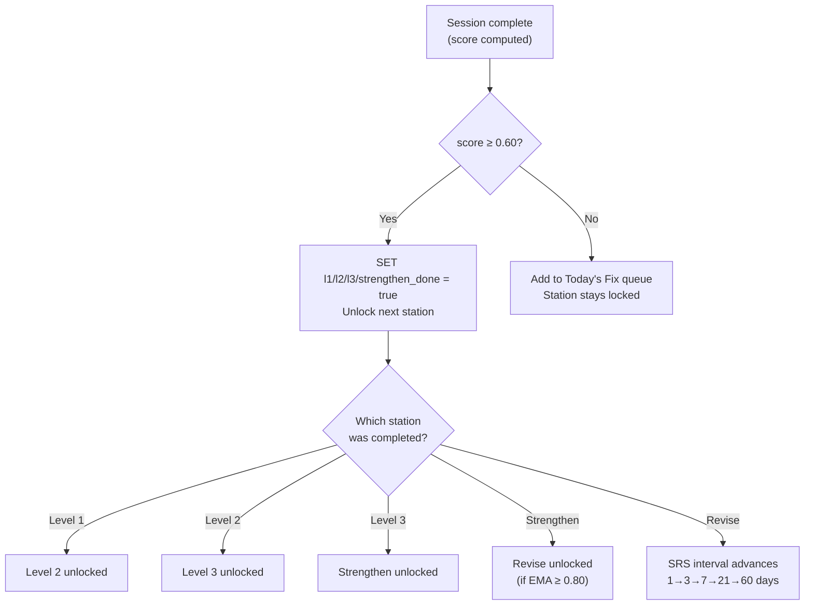

# Scoring & Mastery

## EMA Formula

BrainMaps uses an **Exponential Moving Average** over the student's last 5 sessions on a concept. More recent sessions carry more weight.

```
weights = [0.35, 0.25, 0.20, 0.12, 0.08]   (most recent → oldest)

EMA = Σ(score_i × weight_i) / Σ(weight_i)
```

**Example:**

```
Sessions (newest first): [0.90, 0.60, 0.40, 0.70, 0.50]

EMA = (0.90×0.35 + 0.60×0.25 + 0.40×0.20 + 0.70×0.12 + 0.50×0.08)
    / (0.35 + 0.25 + 0.20 + 0.12 + 0.08)

    = (0.315 + 0.150 + 0.080 + 0.084 + 0.040) / 1.00
    = 0.669  →  DEVELOPING
```

## Session Score Composition



The weights above are **not fixed** — the score is simply the average of all answers in the session (each answer contributes equally). The pie reflects typical question-type distribution in a Level 1–3 session (3 questions: 1 MCQ + 1 DESCRIPTIVE + 1 FEYNMAN).

DESCRIPTIVE is **self-assessed** — it doesn't contribute to the numeric score. The rubric hint is shown after the student submits; they mark themselves.

## Mastery State Thresholds



## Station Unlock Logic



**Unlock threshold = 0.60** (forgiving) — not 0.80.
The student needs 0.80 to be *STRONG*, but only 0.60 to *unlock the next station*. This avoids frustration while still requiring real understanding.

### Tag-gated retries

On a **retry** (station was `needs_fixing`), score alone is not enough: every *targeted* weak tag — a tag that was active for the student before the session AND tested in it — must also be demonstrated at ≥ 50% of its questions (`grade.levelPassGate`). Otherwise the station stays `needs_fixing` even at a high score. First attempts have no targeted tags, so they gate on score only.

The user-facing `passed` flag follows the same rule ("the gate can demote, never promote"): it requires score ≥ 0.80 **and** the station column reading `done`.

## Weak-Tag Lifecycle & Adaptive Retry

Each session's grading pass maintains `student_weak_concepts` (see [database.md](./database.md)):

1. **Detect** — the batch grading call returns `weakConcepts` (constrained to the questions' `key_concepts` vocabulary), unioned with the `key_concepts` of every wrong answer.
2. **Target** — a retry serves a six-question set focused on the student's worst (up to 2) active tags: one tag → 4 on-tag + 2 general; two tags → 3 + 2 + 1 general. A third active tag waits its turn but stays eligible for general slots.
3. **Clear** — a tag tested clean in two sessions flips to `cleared`.
4. **Recheck** — revise sessions silently swap in up to 2 questions for tags cleared in the last 30 days; a miss reactivates the tag and the concept re-enters Today's Fix.

## Today's Fix Queue Priority

Concepts appear in the Fix queue when:
1. State is `VERY_WEAK` or `WEAK`
2. No session completed in the last 23 hours

Ordered by **EMA score ascending** (weakest concepts first — biggest learning opportunity).

```sql
SELECT c.id, c.name, cp.ema_score, cp.state
FROM concept_progress cp
JOIN concepts c ON c.id = cp.concept_id
WHERE cp.student_id = $1
  AND cp.state IN ('VERY_WEAK', 'WEAK')
  AND (cp.last_session_at IS NULL OR cp.last_session_at < now() - INTERVAL '23 hours')
ORDER BY cp.ema_score ASC
LIMIT 8;
```
