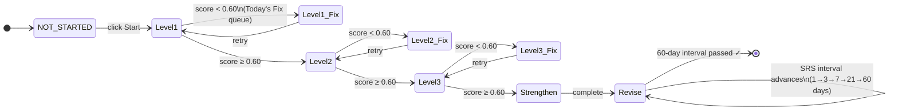
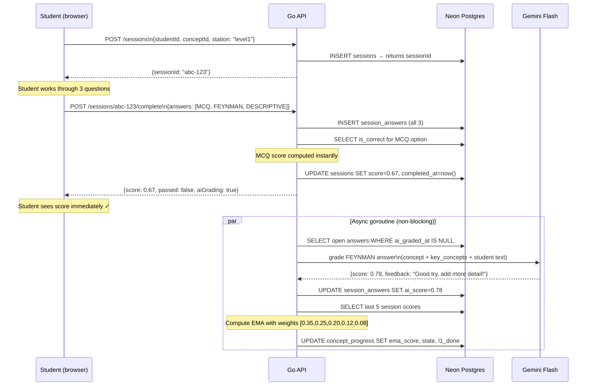
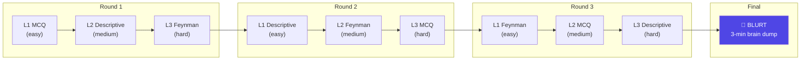
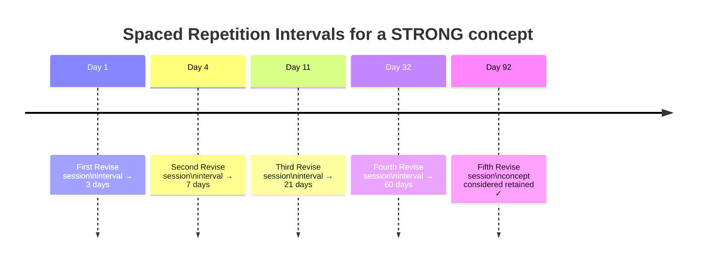

# Session Flow

How a student moves from clicking "Start Level 1" to having their mastery state updated.

## Station State Machine

## Full Session Sequence

## Strengthen Station — Interleaved Order

The Strengthen station serves all Level 1–3 questions in an **offset-rotated** order so the student can't predict difficulty:

Each round has **one question from each difficulty level** and **different types** — so the student's brain has to retrieve without the level-cue as a hint.

## Revise (SRS) Schedule

If the student **fails** a Revise session (score < 0.60), the interval resets to 1 day and the concept moves back to the Fix queue.
